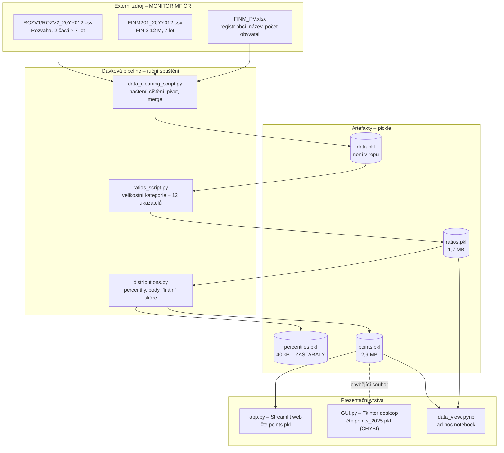
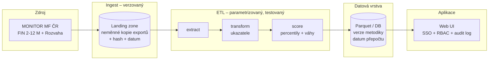

# Technická specifikace – Finanční monitor obcí

| Položka | Hodnota |
|---|---|
| Repozitář | `csas-dev/corpai-municipality-comparison-discovery`; originál na soukromém účtu `MichalJenik/Municipality_Comparison_App` (privátní) |
| Stav gitu | větev `master`, 1 commit, historie původního repozitáře se převzetím ztratila |
| Jazyk / runtime | Python; README uvádí 3.10+, `.devcontainer` cílí na 3.11, `__pycache__` prozrazuje běh na **3.14** |
| Závislosti | `pandas`, `matplotlib`, `numpy`, `openpyxl`, `streamlit>=1.30.0` – **bez pinů verzí** |
| Licence | MIT, © 2026 Denis Šmerda – autor již není zaměstnancem ČS |
| Verze dokumentu | **2.0** – as-is analýza + cílový stav, doplněno o `README.md`, článek ČS a e-mailový thread |
| Datum analýzy | 2026-08-06 |

Doprovodné dokumenty: [docs/business-zadani.md](docs/business-zadani.md), [docs/prevzeti-provoz-a-backlog.md](docs/prevzeti-provoz-a-backlog.md)

> **Kontext:** aplikace není prototyp. Tým Infrastrukturní poradenství přes ni zpracovává vyšší desítky klientských projektů ročně a výstupy předává obcím a městům. Všechny níže uvedené nálezy je třeba číst v tomto světle.

---

## 1. Architektura – současný stav (as-is)

Řešení je **dvoufázové**: offline dávková pipeline generuje statické datové soubory, aplikace je pouze čte.



### 1.1 Soupis souborů

| Soubor | Vel. | Role | Poznámka |
|---|---|---|---|
| `data_cleaning_script.py` | 5 kB | ETL krok 1 – ingest a merge | absolutní cesty `/home/hbrvk/...` |
| `ratios_script.py` | 11 kB | ETL krok 2 – ukazatele | |
| `distributions.py` | 5,7 kB | ETL krok 3 – percentily, body, skóre | |
| `app.py` | 8,5 kB | Streamlit UI | jediná reálně provozovaná varianta |
| `GUI.py` | 13 kB | Tkinter UI | duplicitní logika, nespustitelné |
| `data_view.ipynb` | 2,9 kB | průzkumný notebook | absolutní cesty `C:\Users\milby\...` |
| `points.pkl` | 2,9 MB | výstupní dataset | 12 494 × 30 |
| `ratios.pkl` | 1,7 MB | mezivýstup | 12 494 × 17 |
| `percentiles.pkl` | 40 kB | mezivýstup | 288 × 18 – **nekonzistentní s kódem** |
| `requirements.txt` | – | závislosti | bez verzí |
| `.devcontainer/devcontainer.json` | – | Codespaces | spouští Streamlit s vypnutou XSRF ochranou |
| `.gitignore` | – | – | komentář „# ignore .pkl files“, ale **pattern chybí** |

---

## 2. Datové zdroje

Podle názvů souborů jde o exporty z portálu MONITOR Ministerstva financí ČR:

| Soubor | Obsah | Formát |
|---|---|---|
| `FINM_PV.xlsx` | registr subjektů: rok, IČ, název obce, počet obyvatel | XLSX, první list |
| `FINM201_20YY012.csv` | výkaz FIN 2-12 M za období 012 (prosinec) | CSV, oddělovač `;` |
| `ROZV1_20YY012.csv`, `ROZV2_20YY012.csv` | rozvaha, dvě části | CSV, oddělovač `;` |

Pipeline načítá **7 ročníků** (rok Y až Y−6); pro výpočet je fakticky potřeba 6 (Y−4 … Y).
Celkem 1 + 7 + 14 = **22 vstupních souborů** na jeden běh.

Relevantní sloupce jsou vybírány podle výskytu podřetězce v názvu:

| Výkaz | Hledané podřetězce | Přejmenování |
|---|---|---|
| FIN 2-12 M | `ZC_ICO`, `ZCMMT_ITM`, `ZU_ROZKZ` | `ICO`, `Account`, `Amount` |
| Rozvaha | `ZC_ICO`, `ZC_POLVYK`, `ZC_SYNUC`, `ZU_AONET` | `ICO`, `Account`, `Syn. Account`, `Amount` |

U rozvahy se klíč skládá jako `"{položka výkazu} = {syntetický účet}"`, např. `D.III.36. = 384`.
Oba výkazy se pak pivotují (`index=ICO`, `columns=Account`, `values=Amount`, `aggfunc=sum`) do širokého tvaru, kde **každý účet je samostatný sloupec**.

### 2.1 Filtr obcí

```python
actually_municipality = [i for i in df_renamed['Name'] if not i.endswith(') ')]
df_clean = df_renamed.drop(df_renamed[df_renamed['Name'].isin(actually_municipality)].index, axis=0)
```

Ponechány jsou pouze řádky, jejichž `Name` končí `") "` – tedy formát `"Staré Smrkovice (Jičín) "` (obec + okres + koncová mezera). Název proměnné je invertovaný vůči skutečné sémantice, což je zdroj nedorozumění při údržbě.

---

## 3. Datový model

### 3.1 `points.pkl` – hlavní výstupní dataset

`pandas.DataFrame`, **12 494 řádků × 30 sloupců**, ~2,9 MB.

| Sloupec | Typ | Popis |
|---|---|---|
| `ICO` | `int64` | IČO obce – **bez úvodních nul** |
| `Name` | `object` | `"Obec (Okres) "` včetně koncové mezery |
| `Category` | `category` | jedna z 12 velikostních kategorií |
| `Year` | `int64` | 2024 nebo 2025 |
| `Number_of_citizens` | `int64` | 15 … 1 397 880 |
| 12× `<ukazatel>` | `float64` | hodnota ukazatele |
| 12× `<ukazatel>_score` | `float64` | body 0–10 |
| `Finální_skóre` | `float64` | vážený součet, 0,2 … 9,9 |

Klíč: `(ICO, Year)` – ověřeno, 0 duplicit. Unikátních IČO: 6 251; na rok 6 247 řádků.

**Profil dat (ověřeno):**

| Ukazatel | min | max | NaN |
|---|---:|---:|---:|
| Celkové příjmy na obyvatele | 18 049,95 | 634 356,77 | 0 |
| Daňové příjmy na obyvatele | 16 702,18 | 340 340,10 | 0 |
| Finanční nezávislost | −106,50 | 92,02 | 0 |
| Finanční soběstačnost | −360,18 | 828,52 | 0 |
| Výše dluhu k saldu běžného rozpočtu | −920,19 | 13 113,13 | 0 |
| Krytí dluhu provozním přebytkem | −501,97 | 1 092,54 | 0 |
| Krytí kapitál. výdajů inv. transfery | 0,00 | **334 544 300,00** | 0 |
| Pravidlo rozpočtové odpovědnosti | 0,00 | 1 550,68 | 0 |
| Podíl cizích zdrojů na aktivech | 0,06 | 517,92 | 0 |
| Běžná likvidita | 0,06 | 695,55 | 0 |
| Rychlá likvidita | 0,00 | 681,91 | 0 |
| Daň z nemovitosti | 51 948,33 | 2 721 822 768,10 | 0 |

`Finální_skóre`: průměr 7,14; medián 7,60; p10 = 4,5; p90 = 9,0; min 0,2; max 9,9.

### 3.2 `ratios.pkl`

12 494 × 17 – shodné s `points.pkl` bez bodových sloupců a bez finálního skóre.

### 3.3 `percentiles.pkl`

288 × 18 = 12 kategorií × 2 roky × 12 řádků (hranice pásem) × (Category, Year + 16 sloupců).

> **Nekonzistence:** soubor obsahuje sloupce `Závazky_k_bilanci`, `Závazky_k_přebytku`, `Rozpočtová_zodpovědnost`, `Závazky_k_aktivům`, které se **v současném kódu vůbec nevyskytují**. Byl vygenerován starší verzí `distributions.fixed_percentiles()`. Aktuální kód by vytvořil 14 sloupců, ne 18. Artefakty v repozitáři tedy nepocházejí z jednoho běhu jedné verze kódu.
> Naproti tomu `points.pkl` byl ověřen jako konzistentní se současným kódem (bodování i vážený součet přepočítány ručně a souhlasí).

---

## 4. Výpočet ukazatelů (`ratios_script.py`)

### 4.1 Velikostní kategorie

`pd.cut` nad `Number_of_citizens`, hranice `[0, 100, 200, 500, 1000, 2000, 5000, 10000, 20000, 50000, 100000, 1000000, inf]`, `right=True`, `include_lowest=True`.

### 4.2 Agregace položek rozpočtové skladby

Pomocná funkce:

```python
def appending_ratio_logic(col_name, wanted_accounts, not_wanted_accounts):
    return col_name.startswith(wanted_accounts) and not col_name.startswith(not_wanted_accounts)
```

Výběr sloupců je tedy **prefixový nad názvem sloupce**. To znamená, že jakákoli změna kódování položek v exportu MONITOR tiše změní výsledek.

### 4.3 Definice ukazatelů

| Mezivýpočet | Definice |
|---|---|
| `Celkové_příjmy` | Σ tříd `1,2,3,4` minus `4132`–`4139` |
| `Daňové_příjmy` | Σ třídy `1` |
| `Vlastní_příjmy` | Σ (`2`,`31`,`13`,`15`) − (`214`,`24`,`3114`–`3119`,`138`,`312`) − položka `4131` |
| `Čisté_běžné_příjmy` | Σ (`2`,`31`,`1`,`41`) − (`214`,`1122`,`4131`,`4133`–`4139`,`312`,`24`) |
| `Čisté_běžné_výdaje` | Σ (`5`) − (`5141`,`5144`,`5146`,`530`,`534`,`535`,`537`,`538`,`539`,`5903`,`56`,`5341`,`5142`,`5149`) − Σ(`1122`,`3122`,`5363`,`24`,`3121`) |
| `Běžné_příjmy` | Σ (`1`,`2`,`41`) − (`4133`–`4139`) |
| `Běžné_výdaje` | Σ (`5`) − (`5141`,`5144`,`530`,`5311`–`5318`,`5342`–`5349`,`535`,`537`,`538`,`539`) |
| `Celkové_závazky` | `D. = -` − (`D.I. = -` + `D.III.36. = 384` + `D.III.35. = 383`) |
| `PPE_prodáno` | Σ (`3`) − `3121` |
| `Kapitálové_výdaje` | Σ (`6`); **hodnota 0 nahrazena 1** |
| `Investiční_kapitálové_příjmy` | Σ (`42`) |
| `Dluh` | Σ rozvahových řádků 281, 282, 283, 289, 322, 326, 362, 451, 452, 453, 456, 457, 459 |
| `Průměr_příjmů` | průměr `Celkové_příjmy` za **4 předcházející** roky (rok Y se nezapočítává) |

Výsledné ukazatele:

$$
\begin{aligned}
\text{Celkové příjmy na obyv.} &= \frac{\text{Celkové\_příjmy}}{\text{Number\_of\_citizens}} \\[4pt]
\text{Daňové příjmy na obyv.} &= \frac{\text{Daňové\_příjmy}}{\text{Number\_of\_citizens}} \\[4pt]
\text{Finanční nezávislost} &= \frac{\text{Vlastní\_příjmy}}{\text{Čisté\_běžné\_příjmy}}\cdot 100 \\[4pt]
\text{Finanční soběstačnost} &= \frac{\text{Vlastní\_příjmy}}{\text{Čisté\_běžné\_výdaje}}\cdot 100 \\[4pt]
\text{Výše dluhu k saldu} &= \frac{\text{Celkové\_závazky}}{\text{Běžné\_příjmy} - \text{Běžné\_výdaje}} \\[4pt]
\text{Krytí dluhu provozním přebytkem} &= \frac{\text{Celkové\_závazky}}{\text{Čisté\_běžné\_příjmy} - \text{Čisté\_běžné\_výdaje} - \text{PPE\_prodáno}} \\[4pt]
\text{Krytí kapitál. výdajů} &= \frac{\text{Investiční\_kapitálové\_příjmy}}{\text{Kapitálové\_výdaje}}\cdot 100 \\[4pt]
\text{Pravidlo rozpočtové odpovědnosti} &= \frac{\text{Dluh}}{\text{Průměr\_příjmů}}\cdot 100 \\[4pt]
\text{Podíl cizích zdrojů na aktivech} &= \frac{\texttt{D. = -}}{\texttt{AKTIVA = -}}\cdot 100 \\[4pt]
\text{Běžná likvidita} &= \frac{\texttt{B.III}+\texttt{B.II}+\texttt{B.I}+\texttt{A.IV} - 385 - 381}{\texttt{D.III} - 384 - 383} \\[4pt]
\text{Rychlá likvidita} &= \frac{\texttt{B.III}}{\texttt{D.III} - 384 - 383} \\[4pt]
\text{Daň z nemovitosti} &= \text{položka } 1511
\end{aligned}
$$

**Poznámky k metodice, které vyžadují potvrzení metodika:**
* V čitateli běžné likvidity je zahrnuto `A.IV` = *Dlouhodobé pohledávky*. Standardní běžná likvidita pracuje pouze s oběžnými aktivy (`B.*`).
* `Daň_z_nemovitosti` je **absolutní částka v Kč**, nikoli poměrový ukazatel; není normalizována na obyvatele.
* `Pravidlo rozpočtové odpovědnosti` používá průměr příjmů za 4 **předcházející** roky. Zákon č. 23/2017 Sb. stanoví limit 60 %; pevná pásma v kódu končí na 50 %, model je tedy přísnější než zákon.

### 4.4 Filtr na konci pipeline (`clean_ratios`)

```python
df = df[df['Year'].isin([1999 + year, 2000 + year])]
df = df.dropna(subset=['Běžná_likvidita'])
```

Ponechány jsou jen sloupce `columns[:5]` + 12 ukazatelů, a jen **poslední dva roky**. Parametr `year` je dvouciferný (uživatel zadává `25`), takže `1999 + 25 = 2024` a `2000 + 25 = 2025`. Nečitelné a bez validace.

---

## 5. Bodování a skóre (`distributions.py`)

### 5.1 Percentilová pásma

Pro každou kombinaci (kategorie, rok) a každý ukazatel:

1. Odstraní se `NaN`.
2. Odfiltrují se odlehlé hodnoty mimo $[Q_1 - 1{,}5\cdot IQR,\; Q_3 + 1{,}5\cdot IQR]$.
3. Spočítají se decily (10, 20, … 100).
4. Vznikne vektor 12 hranic: $[-\infty, p_{10}, \dots, p_{100}, +\infty]$.

### 5.2 Pevná pásma (`fixed_percentiles`)

Šest ukazatelů **přepíše** datově odvozená pásma pevnými hodnotami, identickými pro všechny kategorie a roky:

| Ukazatel | Pevné hranice |
|---|---|
| Výše dluhu k saldu běžného rozpočtu | `[-inf, 0.75, 1.5, 2.25, 3, 3.75, 4.5, 5.25, 6, 6.75, 7, inf]` |
| Krytí dluhu provozním přebytkem | `[-inf, 0.75, 1.5, 2.25, 3, 3.75, 4.5, 5.25, 6, 6.75, 7, inf]` |
| Pravidlo rozpočtové odpovědnosti | `[0, 1.4, 6.8, 12.2, 17.6, 23, 28.4, 33.8, 39.2, 44.6, 50, inf]` |
| Podíl cizích zdrojů na aktivech | `[0, 5, 7, 9, 11, 13, 16, 18, 20, 22, 23, inf]` |
| Běžná likvidita | `[0, 1.4, 1.8, 2.2, 2.6, 3.0, 3.4, 3.8, 4.2, 4.8, 5.0, inf]` |
| Rychlá likvidita | `[0, 1.3, 1.6, 1.9, 2.2, 2.5, 2.8, 3.1, 3.4, 3.7, 4.0, inf]` |

> Čtyři z nich začínají hodnotou `0`, nikoli `-inf`. **Záporná hodnota tedy padá mimo definovaná pásma a `pd.cut` vrátí `NaN`** → `NaN` se propaguje do finálního skóre. V současném datasetu k tomu nedochází, ale jde o latentní chybu.

### 5.3 Přiřazení bodů

```python
reversed_percentiles = ['Výše_dluhu_k_saldu_běžného_rozpočtu', 'Krytí_dluhu_provozním_přebytkem',
                        'Pravidlo_rozpočtové_odpovědnosti', 'Podíl_cizích_zdrojů_na_aktivech']
```

`pd.cut(data, basket, include_lowest=True, duplicates='drop', labels=names)`, kde `names` je `0..10` pro běžné ukazatele a `10..0` pro obrácené.

### 5.4 Finální skóre

$$\text{Finální\_skóre} = \sum_{i=1}^{12} w_i \cdot s_i, \qquad \sum w_i = 1$$

```python
ratio_weights = np.array([0.05, 0, 0.05, 0.15, 0.2, 0.15, 0.05, 0.15, 0.05, 0.1, 0.05, 0])
```

Pořadí vah je vázáno **pozicí** na `ratios.columns[5:]`; `final_score()` navíc bere `df.columns[-12:]`. Jakákoli změna pořadí sloupců tiše přiřadí váhy jiným ukazatelům. Kritická křehkost.

*Ověření na reálném řádku (`ICO 35513`, 2024):*
body `[5,4,5,3,4,4,2,0,6,8,9,6]` × váhy = **4,0** = hodnota v `points.pkl`. ✔

---

## 6. Prezentační vrstva

### 6.1 `app.py` – Streamlit

| Prvek | Implementace |
|---|---|
| Autentizace | jedno sdílené heslo z `st.secrets["app_password"]`, porovnání `==`, stav v `st.session_state` |
| Načtení dat | `pickle.load("points.pkl")` v `@st.cache_data` |
| Vyhledávání | `query.isdigit()` → `ICO == int(query)`, jinak `Name.str.contains(query, case=False)` |
| Výběr záznamu | `municipality_data[...].iloc[0]` |
| Záložka 1 | `st.metric` × 4 + `st.dataframe` s 12 ukazateli + `st.success` s finálním skóre |
| Záložka 2 | mřížka 4 × 3 histogramů (`matplotlib`), svislá čára = pozice obce |
| Záložka 3 | histogram finálního skóre |
| Meze osy X | `get_auto_bounds()` – IQR ± 1,5, rozšířeno tak, aby obsahovalo hodnotu obce; uživatel může přepsat |
| Nastavení grafů | počet binů (10–100, default 40), ruční `x_min` / `x_max` |

### 6.2 `GUI.py` – Tkinter

Funkčně ekvivalentní desktopová varianta (ttk, `FigureCanvasTkAgg`, `Treeview`), připravená pro balení PyInstallerem (`get_resource_path` / `sys._MEIPASS`). Čte `points_2025.pkl`, který **v repozitáři není**. Neobsahuje žádnou autentizaci. Logika `get_auto_bounds` a vykreslování je zkopírovaná z `app.py`.

### 6.3 `data_view.ipynb`

Průzkumný notebook s absolutními cestami na `C:\Users\milby\OneDrive\Plocha\data_monitor\...` a odkazy na neexistující `points_2024.pkl`. Bez výstupů, bez dokumentace.

### 6.4 Distribuční kanály

| Kanál | Doklad | Stav při převzetí |
|---|---|---|
| Webová aplikace v prohlížeči (Streamlit) | „aplikace, která běží v internetovém prohlížeči“ – e-mail 27. 7. 2026 | není známo, kde hostuje; chybí `secrets.toml` |
| Zkompilovaný `.exe` v **GitHub Releases** | README: „For regular users, a compiled .exe version is available in the Releases section“ | Releases jsou na **soukromém účtu**, nebyly předány |

To vysvětluje, proč `points_2025.pkl` není v repozitáři – do `.exe` se přibaluje při buildu (PyInstaller, `sys._MEIPASS`). **Banka tedy nemá kontrolu nad artefaktem, který uživatelé spouštějí.** Nutno vyjasnit, kterou variantu tým reálně používá.

### 6.5 Nepřesnosti původního README

| Tvrzení README | Skutečnost |
|---|---|
| „balance sheets and **profit and loss statements**“ | používá se Rozvaha + **FIN 2-12 M** (plnění rozpočtu); výkaz zisku a ztráty se nepoužívá vůbec |
| „Comparisons are always made strictly within a single municipal size category **to ensure a fair assessment**“ | u kategorií nad 50 000 obyvatel je v peer skupině 1–12 subjektů – srovnání není statisticky podložené (T-07) |
| „Python 3.10+“ | `__pycache__` obsahuje bytecode CPythonu 3.14, devcontainer cílí na 3.11 |
| README a architektura GUI byly vytvořeny s pomocí AI (uvedeno v README) | nebyly revidovány – viz nepřesnosti výše |

---

## 7. Nálezy

Závažnost: **K** = kritická, **V** = vysoká, **S** = střední, **N** = nízká.

### 7.1 Správnost výpočtu

| ID | Nález | Důkaz | Záv. |
|---|---|---|---|
| T-01 | **Záporný jmenovatel = nejlepší hodnocení.** U obcí s provozním schodkem je `Výše_dluhu_k_saldu` záporná, spadne do nejnižšího pásma a při obrácené škále dostane 10 bodů (váha 20 %). | 498 řádků se zápornou hodnotou, **všechny** mají `_score = 10.0`; 542 řádků u `Krytí_dluhu_provozním_přebytkem` | **K** |
| T-02 | `Kapitálové_výdaje.replace(0, 1)` obchází dělení nulou dosazením 1 Kč. | max `Krytí_kapitálových_výdajů` = 334 544 300 % | V |
| T-03 | Čtyři pevná pásma začínají na `0` místo `-inf` → záporné hodnoty dají `NaN` skóre. | `fixed_percentiles()` | V |
| T-04 | Váhy jsou navázány na **pozici** sloupce (`columns[-12:]`, `columns[5:]`). Přeuspořádání sloupců tiše zamění váhy. | `final_score()`, `list_of_ratios` | V |
| T-05 | Dva ukazatele mají váhu 0, ale zobrazují se jako bodované. | `ratio_weights[1] = 0`, `ratio_weights[11] = 0` | V |
| T-06 | Inflace skóre – medián 7,6/10, 87 % obcí ≥ 5. Slabá rozlišovací schopnost. | popisná statistika `Finální_skóre` | V |
| T-07 | Peer skupiny nad 50 tis. obyvatel mají 1–12 členů; decily jsou degenerované. | obsazenost kategorií | S |
| T-08 | `Daň_z_nemovitosti` je absolutní částka, nikoli poměr; medián se mezi kategoriemi liší o 4 řády. | 2,6 · 10⁵ (0–100 obyv.) vs. 2,7 · 10⁹ (Praha) | S |
| T-09 | `A.IV` (dlouhodobé pohledávky) v čitateli běžné likvidity – odchylka od standardní definice. | `casual_liquidity()` | S |
| T-10 | Žádné testy, žádná validace vstupů, žádná rekonciliace se zdrojem. | absence testovacích souborů | V |

### 7.2 Aplikace a UX

| ID | Nález | Důkaz | Záv. |
|---|---|---|---|
| T-11 | **Regex injection / pád aplikace.** `Name.str.contains(query)` interpretuje vstup jako regulární výraz. Znak `(` vyvolá `re.error: missing ), unterminated subpattern`. Zároveň riziko ReDoS. Oprava: `regex=False`. | reprodukováno na datech | V |
| T-12 | **Tichý výběr první shody.** `iloc[0]` bez upozornění. 591 duplicitních názvů obcí v roce 2025 („Nová Ves“ 14×, „Petrovice“ 9×, „Němčice“ 9×); dotaz „Lhota“ odpovídá 65 obcím. | agregace nad `Name` | **K** |
| T-13 | `ICO` uloženo jako `int64` → ztráta úvodních nul. 11 916 z 12 494 záznamů má 6 číslic, jen 544 osm. | délka `str(ICO)` | V |
| T-14 | `Name` obsahuje okres v závorce a **koncovou mezeru** – nevhodné pro zobrazení i pro exact-match hledání. | `'Staré Smrkovice (Jičín) '` | S |
| T-15 | Vyhledávání je citlivé na diakritiku; „Ujezd“ nenajde „Újezd“. | `str.contains` bez normalizace | S |
| T-16 | `app.py` nezavírá matplotlib figury (`plt.close` chybí) → únik paměti při každém rerunu. `pyplot` má globální stav a není bezpečný pro souběžné session. | `app.py`, záložky 2 a 3 | V |
| T-17 | UI nezobrazuje datum dat, verzi metodiky, definice ukazatelů ani disclaimer. | – | V |
| T-18 | Chybové hlášky odkazují na technické detaily („Soubor points.pkl nebyl nalezen“, „Sloupec Name chybí“) – nevhodné pro netechnické uživatele. | `app.py` | N |

### 7.3 Bezpečnost

| ID | Nález | Důkaz | Záv. |
|---|---|---|---|
| T-19 | **Sdílené statické heslo**, porovnání prostým `==`, bez identity, MFA, rate-limitingu, lockoutu, expirace session a bez auditního logu. Nekompatibilní s IAM banky. | `app.py`, řádky s `st.secrets` | **K** |
| T-20 | **Deserializace pickle.** `pickle.load()` provádí libovolný kód. Kdokoli se zápisem k `points.pkl` získá RCE na hostiteli aplikace. | `load_data()`, `GUI.__init__` | **K** |
| T-21 | Devcontainer spouští `streamlit run app.py --server.enableCORS false --server.enableXsrfProtection false` → **vypnutá ochrana proti CSRF**. | `.devcontainer/devcontainer.json` | V |
| T-22 | Implikovaný deployment je GitHub Codespaces / Streamlit Community Cloud → data a odvozené hodnocení by opustily perimetr banky. | `.devcontainer`, `portsAttributes` | **K** |
| T-23 | Regex injection ve vyhledávání (viz T-11). | – | V |
| T-24 | `.gitignore` obsahuje komentář „# ignore .pkl files“, ale odpovídající pattern chybí → 4,7 MB binárních dat by se commitlo do repozitáře. | `.gitignore` | S |

### 7.4 Provoz a udržovatelnost

| ID | Nález | Důkaz | Záv. |
|---|---|---|---|
| T-25 | **Absolutní cesty ze dvou soukromých počítačů** (`/home/hbrvk/projects/old/MONITOR/...`, `C:\Users\milby\OneDrive\Plocha\...`). Pipeline nelze nikde jinde spustit. | `data_cleaning_script.py`, `data_view.ipynb` | **K** |
| T-26 | Skripty zapisují pickle **jako vedlejší efekt importu** (volání na úrovni modulu). Import modulu přepíše data na disku. | konec všech tří ETL skriptů | V |
| T-27 | Parametrizace přes `input()` dvouciferným rokem; `1999 + year` / `2000 + year`. Bez validace, nelze spustit neinteraktivně. | `data_cleaning_script.py`, `ratios_script.py` | V |
| T-28 | `assign_points()` volá `complete_all_years(category_percentiles)` uvnitř smyčky → percentilová tabulka se přepočítává **576×** (24 × 24) místo 1×. | `distributions.py` | S |
| T-29 | `percentiles.pkl` v repozitáři je nekompatibilní se současným kódem (obsahuje `Závazky_k_bilanci`, `Závazky_k_přebytku`, `Rozpočtová_zodpovědnost`, `Závazky_k_aktivům`). Chybí verzování a lineage artefaktů. | schéma souboru | V |
| T-30 | **Předání je neúplné.** `GUI.py` čte neexistující `points_2025.pkl`; `app.py` vyžaduje neexistující `.streamlit/secrets.toml`; chybí vstupní data z MONITORu i `.exe` z Releases. Z předaného stavu se **nespustí ani jedna aplikace** a nelze zopakovat přepočet – přitom nastavení běžící instance existuje někde mimo předaný balíček. | výpis adresáře, README | **K** |
| T-31 | Nezapinované závislosti + nesoulad verzí Pythonu (devcontainer 3.11 vs. `__pycache__` 3.14). Pandas 3.x navíc vyžaduje `pyarrow` k načtení těchto pickle souborů. | `requirements.txt`, `__pycache__` | V |
| T-32 | Duplicitní logika ve dvou UI (`get_auto_bounds`, kreslení histogramů zkopírováno). | `app.py` vs. `GUI.py` | S |
| T-33 | Repozitář **bez commitů**, bez README, bez CHANGELOG, bez CI. | `git log` → „does not have any commits yet“ | V |
| T-34 | Výběr sloupců podle prefixu názvu účtu (`str.startswith`) a napevno zadané rozvahové popisky (`'D. = -'`, `'AKTIVA = -'`, `'D.III.36. = 384'`). Jakákoli změna formátu exportu MONITOR tiše rozbije výpočet. | `ratios_script.py` | V |
| T-35 | Přímé odkazy na konkrétní položky (`df['4131']`, `df['1511']`) – chybí-li položka v daném ročníku, skončí běh `KeyError`. | `financial_independency()`, `PPE_tax()` | S |
| T-36 | **Tichá ztráta obcí.** `clean_ratios()` končí `dropna(subset=['Běžná_likvidita'])` – obce bez rozvahových dat jsou vyřazeny bez jakéhokoli záznamu. Dataset má 6 247 obcí na rok, článek ČS uvádí 6 258. Uživatel dostane pouze „obec nenalezena“ a nerozliší překlep od chybějících dat. | `ratios_script.py`, počty řádků | V |
| T-37 | **Nekonzistentní zacházení s položkami 4131 a 4132.** V `Celkové_příjmy` je 4131 zahrnuta a 4132–4139 vyloučeny; v `Čisté_běžné_příjmy` je naopak 4131 vyloučena a 4132 zahrnuta. Navíc se 4131 ještě explicitně odečítá od `Vlastní_příjmy`. | `earnings_per_citizen_ratio()`, `financial_independency()` | V |
| T-38 | Kód i distribuční artefakty (`.exe` v Releases) leží na **soukromém GitHub účtu**. Bankovní repozitář nemá historii. | e-mail 13. 7. 2026, README | **K** |
| T-39 | **Metodika nebyla předána.** Číslování položek používané byznysem (13, 16, 17a) nemá v kódu žádný protejšek – mapování na rozpočtovou skladbu nelze z předaných podkladů rekonstruovat. Zda dokument metodiky existuje jinde, nebylo ověřeno. | e-mail 27. 7. 2026, obsah předání | **K** |
| T-40 | Žádná varianta aplikace nezobrazuje **verzi dat ani verzi metodiky**. Při ročním přepočtu a pololetních změnách metodiky nelze u staršího klientského výstupu zjistit, podle jaké verze vznikl. | `app.py`, `GUI.py` | V |

### 7.5 Co je na řešení dobré

* Čistá funkcionální dekompozice ETL, řetězení přes `.pipe()`, typové anotace.
* Metodicky správný princip srovnání v rámci peer skupiny.
* Rozumné vyloučení odlehlých hodnot pomocí IQR před výpočtem percentilů.
* Vizualizace „histogram + svislá čára“ je pro netechnického uživatele velmi efektivní.
* Pokrytí datasetu je prakticky úplné (6 247 z ~6 254 obcí ČR).
* Automatická volba mezí osy X, která vždy obsahuje hodnotu zkoumané obce, je promyšlený detail.

---

## 8. Doporučená cílová architektura (to-be)



### 8.1 Klíčové změny oproti současnému stavu

| Oblast | Nyní | Cíl |
|---|---|---|
| Formát dat | `pickle` | **Parquet** nebo relační DB – bez rizika RCE, čitelné, verzované |
| Parametrizace | `input()` s dvouciferným rokem | CLI / konfigurační soubor, plný čtyřciferný rok, validace |
| Cesty | absolutní, hardcoded | konfigurace / proměnné prostředí |
| Spouštění | ruční, vedlejší efekt importu | funkce `main()`, orchestrátor, idempotentní běh |
| Váhy a prahy | pole v kódu | konfigurační soubor s verzí metodiky, uloženou spolu s výsledkem |
| Identifikace obce | `int` IČO | **`str` IČO na 8 znaků s úvodními nulami**, název a okres samostatně |
| Vyhledávání | `str.contains` s regexem, `iloc[0]` | normalizace diakritiky, `regex=False`, **seznam shod k výběru** |
| Autentizace | sdílené heslo | SSO (Entra ID), RBAC, audit log |
| UI | Streamlit + Tkinter | jedna webová aplikace; desktopovou variantu zrušit |
| Grafy | globální `pyplot` | objektové API + `plt.close()`, nebo Plotly/Altair |
| Testy | žádné | unit testy ukazatelů, property testy bodování, rekonciliace na vzorku |
| CI | žádná | lint, testy, kontrola schématu výstupu, kontrola reprodukovatelnosti |

### 8.2 Konkrétní opravy s nejvyšší prioritou

1. **T-01** – definovat chování při záporném/nulovém jmenovateli. Doporučení: hodnotu neuvádět (`NaN`) a v UI zobrazit „provozní schodek“, nikoli přidělovat 10 bodů.
2. **T-25 / T-27** – parametrizovat a zprovoznit pipeline. **Tvrdý termín: březen 2027** (viz CR-01).
3. **T-12** – vyhledávání vrací seznam shod; výběr vždy explicitní.
4. **T-20** – nahradit `pickle` za Parquet.
5. **T-19 / T-22 / T-38** – SSO, provoz uvnitř banky, kód i artefakty v bankovním repozitáři.
6. **T-13** – IČO jako řetězec s úvodními nulami.
7. **T-11** – `regex=False` + normalizace vstupu.
8. **T-04 / T-05 / T-18** – váhy jako pojmenovaný mapping `ukazatel → váha` ve verzované konfiguraci, ne poziční pole v kódu.

---

## 9. Testovací strategie (návrh)

| Vrstva | Test | Poznámka |
|---|---|---|
| Jednotkové | každý ukazatel na syntetickém DataFrame se známým výsledkem | pokrýt i hraniční případy: nulový a záporný jmenovatel, chybějící položka |
| Jednotkové | `pd.cut` bodování – hodnota přesně na hranici pásma, hodnota pod minimem, nad maximem | `include_lowest`, obrácené škály |
| Vlastnostní | finální skóre vždy v $[0, 10]$; součet vah = 1; body vždy v $\{0,\dots,10\}$ nebo `NaN` | |
| Schématové | výstupní dataset má očekávané sloupce, typy a klíč `(ICO, Year)` bez duplicit | |
| Rekonciliační | 20 obcí napříč kategoriemi ověřeno proti nezávislému výpočtu metodika | akceptační kritérium A5 |
| Regresní | zafixovaný „golden“ výstup pro daný vstupní snapshot; každá změna metodiky vyžaduje vědomé přegenerování | |
| Aplikační | vyhledávání: prázdný vstup, `(`, `.*`, diakritika, IČO s úvodními nulami, název s 14 shodami | |

---

## 10. Provozní poznámky

* **Přepočet dat** je roční záležitost vázaná na zveřejnění výkazů MF ČR za uzavřený rok. Musí být evidováno datum exportu, hash vstupních souborů a verze metodiky.
* **Retence:** výstupní datasety je vhodné archivovat po ročnících, aby bylo možné rekonstruovat historicky vydané skóre.
* **Monitoring:** kontrola počtu obcí (~6 250), počtu `NaN` skóre (očekáváno 0), rozsahu skóre (0–10) a rozdílu mediánu proti předchozímu roku jako sanity check.
* **Kapacita:** dataset má v paměti jednotky MB; není důvod pro jakoukoli distribuovanou technologii.

---

## 11. Reprodukce zjištění

Ověření uvedených čísel vyžaduje prostředí s `pandas` a `pyarrow` (pandas 3.x načte tyto pickle soubory jen s `pyarrow`):

```powershell
python -m venv .venv
.\.venv\Scripts\python.exe -m pip install pandas pyarrow
```

```python
import pickle
import pandas as pd

with open("points.pkl", "rb") as f:
    p = pickle.load(f)

# T-01: záporný jmenovatel -> maximální skóre
col = "Výše_dluhu_k_saldu_běžného_rozpočtu"
neg = p[p[col] < 0]
print(len(neg), neg[col + "_score"].unique())        # 498  [10.]

# T-12: duplicitní názvy obcí
base = p.loc[p["Year"] == 2025, "Name"].str.split(r" \(", regex=True).str[0]
print((base.value_counts() > 1).sum())               # 591

# T-13: ztracené úvodní nuly v IČO
print(p["ICO"].astype(str).str.len().value_counts().sort_index())

# T-06: inflace skóre
print(p["Finální_skóre"].describe())
```

---

## 12. Technický rozbor změnových požadavků

Požadavky zadány byznys vlastníkem v e-mailu z 27. 7. 2026. Byznys kontext a priority viz [docs/prevzeti-provoz-a-backlog.md](docs/prevzeti-provoz-a-backlog.md).

### 12.1 CR-01 – Roční aktualizace dat (k 12/2026)

| Aspekt | Zjištění |
|---|---|
| Vstupy | pipeline potřebuje **7 ročníků** (`all_needed_years = range(year-6, year+1)`), pro rok 2026 tedy 2020–2026 = 22 souborů |
| Blokátor č. 1 | absolutní cesty `/home/hbrvk/projects/old/MONITOR/municipality_comp/data/` (T-25) |
| Blokátor č. 2 | vstupní data z MONITORu nebyla předána |
| Blokátor č. 3 | parametr `year` je dvouciferný (`input('Enter year:')` → `26`), následně `1999 + year` / `2000 + year` v `clean_ratios()` (T-27) |
| Blokátor č. 4 | skripty zapisují pickle při importu, ne přes `main()` (T-26) |
| Chování | `clean_ratios()` ponechá pouze **poslední dva roky** – přidáním 2026 vypadne 2024. Nutné rozhodnutí byznysu |
| Výkon | `assign_points()` přepočítává percentilovou tabulku 576× (T-28) – při rozšíření historie roste kvadraticky |
| Nutné kroky | TP-02 (parametrizace), TP-07 (reprodukce současného `points.pkl` z původních vstupů jako důkaz porozumění) |

### 12.2 CR-02 – Daň z nemovitých věcí na obyvatele

Současný kód:

```python
def PPE_tax(df: pd.DataFrame) -> pd.DataFrame:
    df['Daň_z_nemovitosti'] = df['1511']
    return df
```

| Aspekt | Zjištění |
|---|---|
| Současný stav | absolutní částka v Kč, bez normalizace; medián 2,6·10⁵ Kč (obce do 100 obyv.) až 2,7·10⁹ Kč (Praha) |
| Návrh | `df['Daň_z_nemovitosti_na_obyvatele'] = df['1511'] / df['Number_of_citizens']` |
| **Rozpor v zadání** | požaduje se současně „na obyvatele“ **a** „v mil. Kč“. Po přepočtu na obyvatele vychází jednotky v tisících Kč, ne v milionech – nutno vyjasnit, zda jde o dvě různá zobrazení |
| Dopad na skóre | **žádný** – `ratio_weights[11] = 0`. Změna se projeví pouze v tabulce a histogramu |
| Riziko | `df['1511']` je přímý přístup ke sloupci (T-35) |
| Vedlejší efekt | změna názvu sloupce ovlivní poziční výběr `points.columns[5:17]` v `app.py` a `GUI.py` – nutno ověřit pořadí |

### 12.3 CR-03 – Přesun položky 17a (Transfery z komerční činnosti)

Současný kód (`ratios_script.financial_independency`):

```python
wanted_accounts_A = ('2','31','13','15')
not_wanted_accounts_A = ('214','24','3114','3115','3116','3117','3118','3119','138','312')
...
df['Vlastní_příjmy'] = df[all_own_earnings_accounts].sum(axis=1) - df['4131']

wanted_accounts_B = ('2','31','1','41')
not_wanted_accounts_B = ('214','1122','4131','4133','4134','4135','4136','4137','4138','4139','312','24')
...
df['Čisté_běžné_příjmy'] = df[all_clean_earnings_accounts].sum(axis=1)
df['Finanční_nezávislost'] = (df['Vlastní_příjmy'] / df['Čisté_běžné_příjmy']) * 100
```

**Hypotéza mapování (nutné potvrzení metodikem):**

„Transfery z komerční činnosti“ = položka rozpočtové skladby **4131 – Převody z vlastních fondů hospodářské (podnikatelské) činnosti**.

Důkazy pro tuto hypotézu:

1. `- df['4131']` je **jediné explicitní odečtení jedné konkrétní položky** v celém souboru `ratios_script.py`.
2. Odečítá se od `Vlastní_příjmy`, agregátu, který obsahuje třídu 2 (nedaňové příjmy) – odpovídá popisu „odčítá se od položky 13 – Ostatní nedaňové příjmy“.
3. `Vlastní_příjmy` je **společný čitatel právě těch dvou ukazatelů**, které e-mail jmenuje: `Finanční_nezávislost` a `Finanční_soběstačnost` („koeficient samostatnosti“).
4. Název položky 4131 v rozpočtové skladbě přímo odpovídá pojmu „komerční činnost“.

| Aspekt | Zjištění |
|---|---|
| Dopad na skóre | Finanční nezávislost 5 % + Finanční soběstačnost 15 % = **20 % finálního skóre** |
| Směr dopadu | odstranění odečtu **zvýší** `Vlastní_příjmy`, tedy oba ukazatele – odpovídá stížnosti „negativně ovlivňuje výpočet“ |
| Past | 4131 je **již vyloučena** ze jmenovatele `Čisté_běžné_příjmy` přes `not_wanted_accounts_B`. Nekoordinovaná změna vytvoří dvojí započtení |
| Související nález | T-37 – nekonzistentní zacházení s 4131 a 4132 napříč ukazateli. CR-03 je vhodná příležitost to sjednotit |
| Riziko | `df['4131']` – `KeyError`, pokud položku v ročníku nikdo nevykáže (T-35) |
| Povinný krok před nasazením | kvantifikace: počet obcí s nenulovou 4131, rozdělení Δ obou ukazatelů, počet obcí měnících bodové pásmo, rozdělení Δ finálního skóre |
| Retroaktivita | byznys odhaduje dopad na ~10 % obcí; nutno rozhodnout o přepočtu již vydaných analýz |

**Doporučený postup:** neimplementovat „naslepo“. Nejprve získat dokument metodiky s číslováním položek 13 / 16 / 17a (TP-04), potvrdit mapování na 4131, pak připravit změnu **včetně regresního srovnání před/po** a nechat ji schválit metodikem.

### 12.4 Společné předpoklady všech tří CR

Změny metodiky mají probíhat **cca 1× za půl roku**. Aby to bylo bezpečné a opakovatelné, je potřeba:

| # | Předpoklad | Řeší nález |
|---|---|---|
| 1 | Spustitelná a parametrizovaná pipeline | T-25, T-26, T-27 |
| 2 | Definice ukazatelů, vah a prahů v konfiguraci, ne v kódu | T-04, T-18 |
| 3 | Automatizované testy ukazatelů a bodování | T-10 |
| 4 | Regresní srovnání „zlatého“ výstupu před a po změně | T-10 |
| 5 | Verzování metodiky uložené spolu s výsledkem | T-40 |
| 6 | Odolné získávání položek (chybějící sloupec → 0, ne `KeyError`) | T-34, T-35 |
